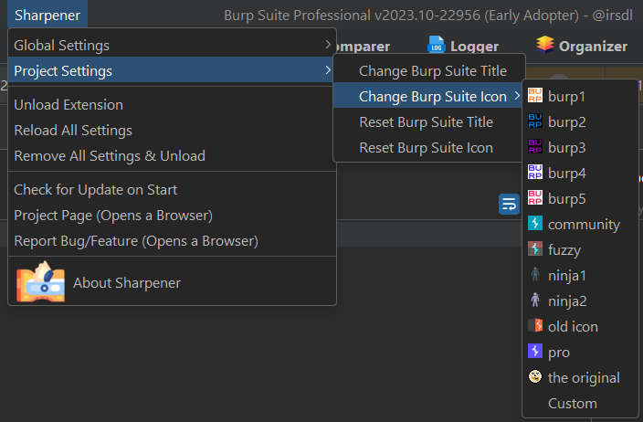
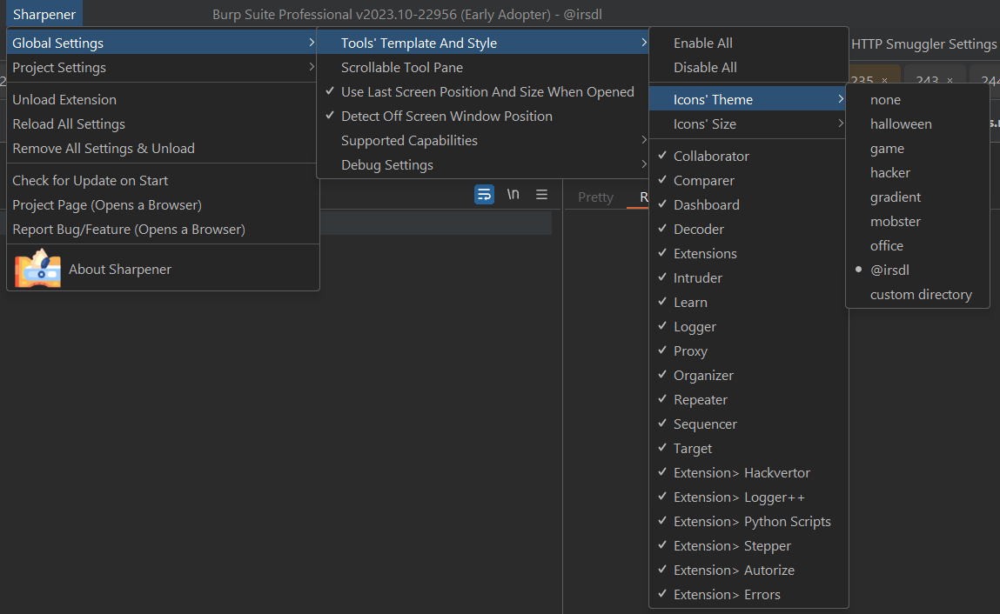
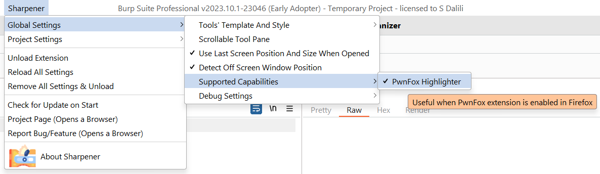

# Burp Suite Sharpener

This extension enhances Burp Suite by adding several UI and functional features, making it more user-friendly.

Refer to the "Burp Suite Compatibility and Reporting Errors" section for detailed information on compatibility.

```text
 ___  _                                      
/ __>| |_  ___  _ _  ___  ___ ._ _  ___  _ _ 
\__ \| . |<_> || '_>| . \/ ._>| ' |/ ._>| '_>
<___/|_|_|<___||_|  |  _/\___.|_|_|\___.|_|
                    |_|
```


## Installation

* Download the latest jar file built by GitHub from [/releases/latest](https://github.com/irsdl/BurpSuiteSharpenerEx/releases/latest), or by going through the [Workflows' Artifacts](https://github.com/irsdl/BurpSuiteSharpenerEx/actions).
* Add it to Burp Suite using the `Extensions` tab

## Features

* Making main tools' tabs more distinguishable by choosing a theme
* Ability to control style of sub-tabs in Repeater and Intruder
* Ability to change Burp Suite title and its icon
* Copy & pasting style ability for Repeater and Intruder tabs
* Pasting style for Repeater and Intruder tabs when their title matches a Regular Expression
* Copy & pasting titles by creating unique titles by adding a number in the end
* Rename titles without a need to double-click on the title
* Jump to first and last tabs in Repeater and Intruder
* Back and Forward feature depends on the previously selected tabs
* Finding Repeater and Intruder tabs when their title matches a Regular Expression
* Scrollable main tool tabs
* Scrollable Repeater and Intruder tabs
* Taking screenshot of repeater or intruder tabs
* Trimming long titles into 100 characters
* Show previously chosen titles for a tab
* Several keyboard shortcuts to make the tab navigation easier, viewable and customisable inside Burp
* Keyboard shortcut to jump from a tab into the HTTP request editor and back to the tab
* Support for PwnFox Firefox extension highlighter
* Ability to save the last size and position of Burp Suite to move it to the same location next time
* Ability to detect off-screen Burp Suite window to bring it to the centre
* Ability to highlight HTTP and WebSocket requests in proxy by detecting the "tempcolorCOLORNAME" pattern and removing it
* Ability to highlight HTTP and WebSocket requests and responses in proxy by detecting the "permcolorCOLORNAME" pattern

## Burp Suite Compatibility and Reporting Errors

This extension targets the most recent Burp Suite release. It was last tested with the pro version 2026.4.3, the most recent stable release at the time of this documentation. It is also compatible with the community edition. The minimum supported version is Burp Suite 2024.2, as that is the first release that requires Java 21.

All changes are released from the `main` branch. See [CHANGES.md](CHANGES.md) for the change history of each release.

We actively use this extension and occasionally observe potential errors, particularly when Burp Suite updates its core functionalities or UI. As an open-source project, we heavily rely on community feedback for enhancements and bug fixes. If you encounter any issues, kindly report them on our [issues page](https://github.com/irsdl/BurpSuiteSharpenerEx/issues). Additionally, if you value our work, please consider [sponsoring](https://github.com/sponsors/irsdl) this project.

## Using the Legacy Extension

In the latest version of this extension, only the most recent version of Burp Suite is supported, as noted above. For older versions of Burp Suite, you can use the legacy version of the extension or refer to the original repository.
The older versions of this extension can be downloaded from the legacy branch (with no support):

* [Legacy-Extension branch releases](https://github.com/mdsecresearch/BurpSuiteSharpener/tree/Legacy-Extension/release)
* [Original repository releases](https://github.com/mdsecresearch/BurpSuiteSharpener/releases)

## About This Repository

Continuation of the Burp Suite Sharpener project, originally released as open source by [MDSec](https://www.mdsec.co.uk/) at [mdsecresearch/BurpSuiteSharpener](https://github.com/mdsecresearch/BurpSuiteSharpener).

## Suggesting New Features

The plan is to add simple but effective missing features to this single extension to make tester's life easier as a must-have companion when using Burp Suite (so we cannot Burp without it!).

Please feel free to submit your new feature requests using `FR: ` in its title in [issues](https://github.com/irsdl/BurpSuiteSharpenerEx/issues).

It would be great to also list any known available extensions which might have implemented suggested features.
Perhaps the best features can be imported from different open-source extensions so the overhead of adding different extensions can be reduced.

## Keyboard Shortcuts

All Sharpener shortcuts can be viewed and changed inside Burp: use the `Sharpener` top menu > `Keyboard Shortcuts`, or the `Keyboard Shortcuts` item at the bottom of a Repeater/Intruder tab right-click menu. Changes are validated (Burp's own default hotkeys such as Ctrl+R cannot be taken) and applied right away.

Each configurable action has ONE shortcut. In the dialog you set it by clicking the cell and pressing the key combination (no typing). A shortcut works anywhere in Burp, even while typing in the editor, so it needs Ctrl, Alt, or a function key. If you press a key that is already used, the dialog offers to move it.

Configurable shortcuts for the Repeater and Intruder tabs (defaults):

| Action                          | Shortcut       |
|---------------------------------|----------------|
| Previous Tab                    | Ctrl+PageUp    |
| Next Tab                        | Ctrl+PageDown  |
| First Tab                       | Alt+Home       |
| Last Tab                        | Alt+End        |
| Focus Tab (from the editor)     | Alt+Up         |
| Show Tab Menu                   | Ctrl+Enter     |
| Find Tabs (RegEx)               | Ctrl+Shift+F   |
| Find Next                       | F3             |
| Find Previous                   | Shift+F3       |
| Back (previously selected tab)  | Alt+Left       |
| Forward                         | Alt+Right      |
| Copy Tab Title                  | Ctrl+Shift+C   |
| Paste Tab Title                 | Ctrl+Shift+V   |
| Rename Tab Title                | F2             |

Fixed tab-header keys (always on when a tab title has the focus, not editable):

| Action                | Key         |
|-----------------------|-------------|
| Previous Tab          | Left Arrow  |
| Next Tab              | Right Arrow |
| First Tab             | Home        |
| Last Tab              | End         |
| Enter Request Editor  | Down Arrow  |

These plain keys only act when a tab header has the focus, so they never disturb the editor. Click a tab title (or use a shortcut jump) to focus the header, then use the arrows to move between tabs and Down to drop into the request editor to edit it. Use Alt+Up (or click) to go back to the tab. After a keyboard jump that started on the header, the focus stays on the header, so pressing an arrow several times keeps navigating.

Notes:

* Ctrl+C and Ctrl+V are unassigned by default, so a paste can never rename a tab by accident. Copy and paste titles use Ctrl+Shift+C and Ctrl+Shift+V, and a pasted title can be reverted from the tab menu under Previous Titles.

Default shortcut for the main Burp window:

| Action                                             | Shortcut   |
|----------------------------------------------------|------------|
| Move Burp Suite Window to the centre of the Screen | Ctrl+Alt+C |

Fixed mouse actions on the Repeater and Intruder tabs (not configurable):

| Action                       | Mouse combination                       |
|------------------------------|-----------------------------------------|
| Show Tab Menu                | Middle-Click<br/>Alt + Any Mouse Key    |
| Scroll Through Tabs          | Mouse Wheel (when enabled in the menu)  |
| Increase Font Size           | Ctrl + Mouse Wheel Up                   |
| Decrease Font Size           | Ctrl + Mouse Wheel Down                 |
| Increase Font Size & Bold    | Middle-Click + Ctrl                     |
| Decrease Font Size & Bold    | Middle-Click + Ctrl + Shift             |
| Big & Red & Bold             | Middle-Click + Shift                    |

## Usage Tips

* After setting style on a sub-tab, setting the same title on another sub-tab will copy its style
* Alt + Any Mouse Click works on empty parts of the tabs which do not contain any text
* Use the `Debug` option in `Global Settings` if you are reporting a bug or if you want to see what is happening
* Check the [extension's GitHub repository](https://github.com/irsdl/BurpSuiteSharpenerEx) rather than BApp Store for the latest updates
* Sample icons are available in the [burpicon-sample/](burpicon-sample/) and [hacker-sample-icons/](hacker-sample-icons/) directories











## Contributing

Pull requests are welcome. A few rules keep the automated release pipeline working:

* All changes go through pull requests into the `main` branch (direct pushes are blocked).
* Build with `./gradlew jar` (requires JDK 21). The test suite must pass: `./gradlew build` runs it headless.
* New or changed behaviour must be covered by test cases in `src/test/java`. The extension cannot run outside Burp Suite, so tests use mocked Montoya interfaces and plain Swing components.
* Releases are created automatically when a pull request that bumps the version is merged. To make a release:
  * Bump `version` in `src/main/resources/extension.properties`. It must stay parseable as a number (for example `4.7`), because the update checker compares it numerically.
  * Add a matching section at the top of [CHANGES.md](CHANGES.md) with the exact heading format `## Version X.Y (YYYY-MM-DD)`. CI copies that section into the GitHub release notes.

## Thanks To

* Corey Arthur [CoreyD97](https://twitter.com/CoreyD97) for [Burp-Montoya-Utilities](https://github.com/CoreyD97/Burp-Montoya-Utilities/). A small part of it (the preferences classes) is now maintained inside this repository under `libs/thirdparty/`; the rest of the library is no longer bundled. See the NOTICE file.
* Bruno Demarche (for initial Swing hack inspiration)

Please feel free to report bugs, suggest features, or send pull requests.

## License

Copyright (C) 2021-2026 Soroush Dalili ([@irsdl](https://github.com/irsdl)).

Released under the GNU Affero General Public License v3.0 with additional terms under section 7 of the license: copies and modified versions must keep the copyright notices and the "Developed by Soroush Dalili (@irsdl)" attribution. See the [LICENSE](LICENSE) and [NOTICE](NOTICE) files.
